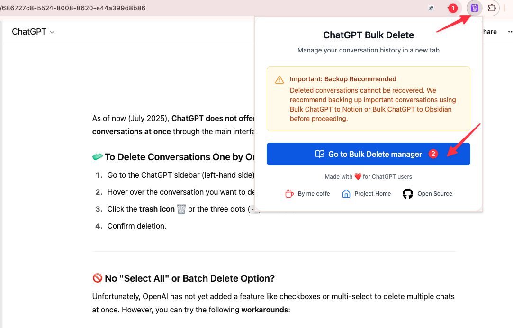
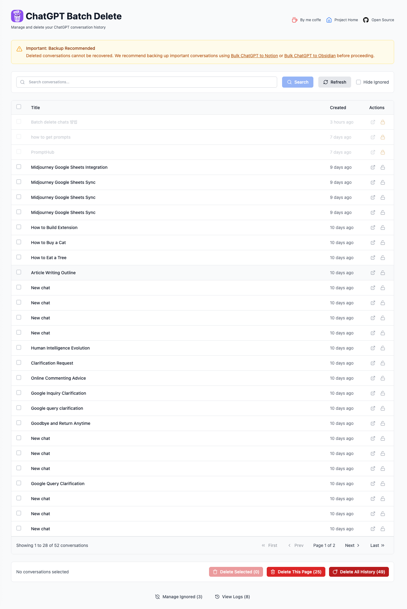
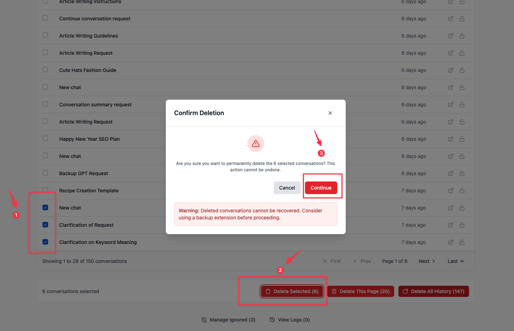
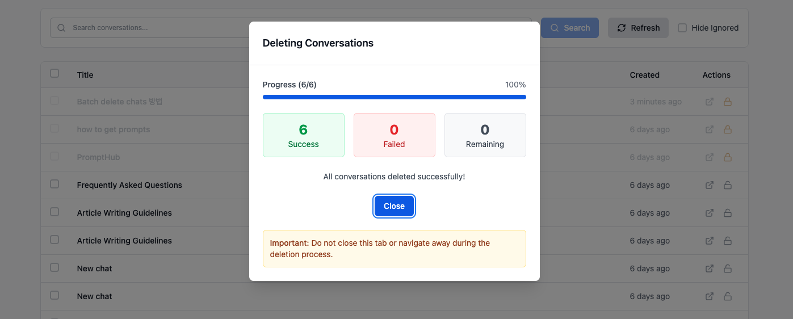

# ChatGPT Bulk Delete

A modern, beautiful, and efficient Chrome extension to bulk delete your ChatGPT conversations with one click. Designed with exquisite UI, smooth experience, and advanced interaction.

## ✨ Features

- Bulk delete all or selected ChatGPT conversations
- Elegant and modern UI (Tailwind CSS + lucide-react icons)
- Fast, safe, and privacy-friendly
- One-click operation, no manual selection needed
- Supports latest ChatGPT interface
- Open source & actively maintained


## 🚀 Demo Preview

<p align="center">
  
  
  
  
</p>

<p align="center">
  
</p>

## 🛠️ Installation

1. Clone this repo:
   ```bash
   git clone https://github.com/your-username/chatgpt-bulk-delete.git
   cd chatgpt-bulk-delete
   ```

2. Install dependencies (using pnpm):
   ```bash
   pnpm install
   ```

3. Build the extension:
   ```bash
   pnpm build
   ```

4. Load the extension in Chrome:
   - Open `chrome://extensions/`
   - Enable "Developer mode"
   - Click "Load unpacked" and select the `dist` or `build` folder


## 🧑‍💻 Usage

1. Open [ChatGPT](https://chat.openai.com/)
2. Click the "Bulk Delete" button in the sidebar
3. Confirm the action to delete all or selected conversations

## 📦 Scripts

| Command         | Description                |
| --------------- | ------------------------- |
| `pnpm install`  | Install dependencies      |
| `pnpm build`    | Build the extension       |
| `pnpm dev`      | Start development mode    |
| `pnpm lint`     | Lint code                 |
| `pnpm format`   | Format code               |

## 🏗️ Development

- Tech stack: React, TypeScript, Tailwind CSS, lucide-react, Vite
- Follow modern best practices and code style
- UI/UX designed for both desktop and mobile

### Start Dev Server

```bash
pnpm dev
```

### Build for Production

```bash
pnpm build
```

## 📄 License

MIT
